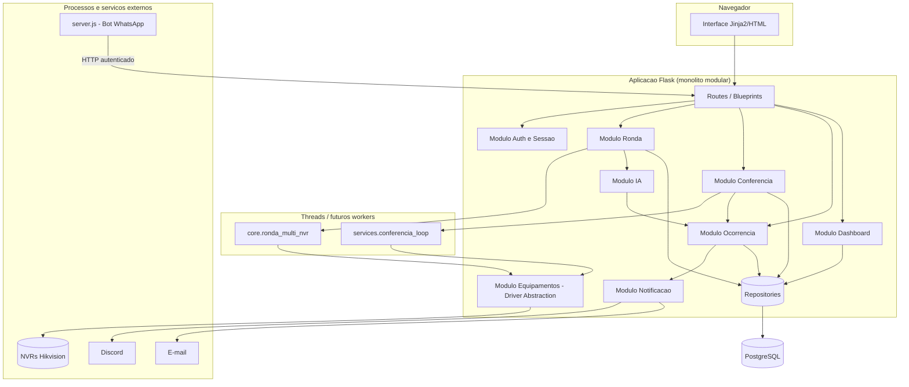

# Arquitetura da Aplicação

## Estado atual (confirmado no código)

```
routes/       → Blueprints Flask, uma rota chama um service
services/     → Regra de negócio (RondaService, DashboardService, IsapiPoller, ...)
repositories/ → Acesso a dado via SQLAlchemy (RondaRepository, AlertaRepository, ...)
models/       → Classes ORM (SQLAlchemy)
core/         → Motor de detecção (ronda_multi_nvr.py), auth decorator, config de NVR
```

Isso já é uma **arquitetura em camadas** (Layered Architecture) razoavelmente aplicada — não é um "monólito simples" desorganizado com SQL espalhado em rotas.

## Problema

Devemos manter esse padrão, evoluí-lo, ou adotar algo mais formal (Clean Architecture, Hexagonal)?

## Alternativas

### 1. Monólito simples (sem camadas)
Rotas acessando banco diretamente, lógica de negócio misturada com HTTP.

- **Vantagens**: nenhuma, para este estágio — é o que o projeto explicitamente **não é** hoje (já evoluiu disso, conforme os próprios docstrings do código mencionam a migração de um script procedural anterior).
- **Desvantagens**: difícil de testar, difícil de manter, alto acoplamento.
- Descartada — seria retroceder em relação ao que já existe.

### 2. Monólito modular (o que já existe, reforçado)
Um único processo/deploy, mas com fronteiras internas claras entre módulos (Routes/Services/Repositories/Models/Core), e — na evolução proposta — módulos de domínio bem definidos (ex.: um "módulo de equipamentos", um "módulo de IA", um "módulo de ocorrências") que não se acessam livremente por baixo, só pela interface pública de cada um.

- **Vantagens**: aproveita 100% do que já existe; testável (cada camada isolável); permite extrair um módulo para serviço separado no futuro **se** necessário, sem redesenho prévio; menor custo operacional (um único deploy, um único processo a monitorar).
- **Desvantagens**: exige disciplina para não deixar módulos se acoplarem livremente (ex.: um service de Ronda importando diretamente um repository de Ocorrência em vez de passar pela camada de serviço de Ocorrência) — é uma disciplina de código, não uma garantia estrutural automática.

### 3. Clean Architecture / Hexagonal (Ports & Adapters)
Domínio no centro, sem depender de framework/banco; adapters para Flask, SQLAlchemy, ISAPI, etc. entram/saem por portas bem definidas.

- **Vantagens**: máximo desacoplamento — trocar Flask por outro framework, ou PostgreSQL por outro banco, exigiria só trocar o adapter; domínio 100% testável sem infraestrutura.
- **Desvantagens**: overhead de abstração real — mais interfaces, mais indireção, curva de aprendizado maior para você aprender e manter sozinho; para o volume de negócio atual (uma equipe de um desenvolvedor, sem intenção de trocar de framework/banco), o benefício não paga o custo de complexidade.
- Vale como **inspiração parcial** (a ideia de "abstrair equipamento atrás de uma interface", ver `architecture/equipamentos.md`, é literalmente um Adapter — um pedaço de Hexagonal aplicado pontualmente onde há valor real), mas adotar Clean Architecture como estilo geral do projeto inteiro é desproporcional ao estágio.

### 4. Microserviços
Serviços separados (ex.: serviço de ronda, serviço de IA, serviço de notificação), cada um com seu próprio deploy/banco/ciclo de vida.

- **Vantagens**: escalabilidade independente por serviço; times diferentes podem evoluir partes diferentes sem colidir.
- **Desvantagens**: exige infraestrutura de orquestração (mensageria, service discovery, observabilidade distribuída), múltiplos deploys, complexidade operacional que um desenvolvedor único não consegue sustentar sozinho no dia a dia; nenhum requisito atual do produto exige escalar partes independentemente ainda.
- Descartada para este estágio — é exatamente o tipo de decisão que você mesmo identificou como "não quero microserviços por moda".

## Recomendação

**Monólito modular** — evoluir o que já existe, reforçando fronteiras internas entre módulos de domínio, com **um único ponto de exceção já parcialmente existente**: o motor de detecção/ronda (`core/ronda_multi_nvr.py`) já roda em thread desacoplada do ciclo de request HTTP (via `repositories/db_session.py:session_scope()`), o que **prepara o terreno** para, se um dia o volume justificar, extrair esse motor para um worker/fila separado — sem que isso signifique adotar microserviços para o resto do sistema.

## Justificativa para este projeto

- Reaproveita 100% da estrutura já existente e já funcional — nenhuma reescrita.
- Compatível com sua capacidade de manter o sistema sozinho (requisito RNF11) — é o estilo arquitetural mais simples que ainda resolve os problemas reais (testabilidade, organização, futura extração pontual).
- Compatível com a decisão de multi-tenancy (opção B, `database/multi-tenancy.md`) — um único processo, um único banco, filtro de `empresa_id` centralizado nos repositories.

## Diagrama de componentes (Mermaid)



## Nota sobre `server.js` (bot WhatsApp)

É o único componente hoje fisicamente separado do monólito — **não por decisão de arquitetura de escalabilidade**, mas por necessidade técnica (a biblioteca `whatsapp-web.js` depende de Node.js/Puppeteer, que não existe em Python). Deve continuar separado pelo mesmo motivo, não deve ser tratado como precedente para separar outros módulos.
