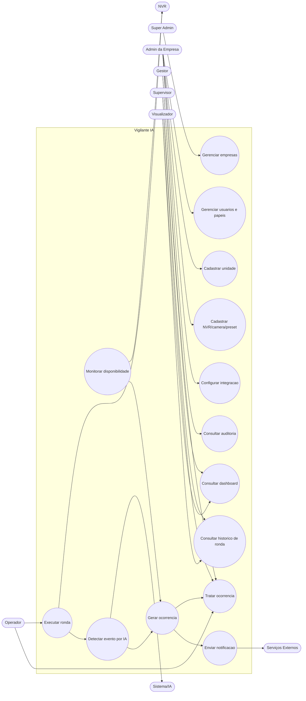

# Casos de Uso — Vigilante IA

## Atores

| Ator | Tipo | Descrição |
|---|---|---|
| Super Admin | Humano | Administra a plataforma, gerencia empresas clientes |
| Admin da Empresa | Humano | Administra uma empresa cliente: usuários, unidades, integrações |
| Gestor | Humano | Acompanha indicadores, trata ocorrências, sem configurar integrações |
| Supervisor | Humano | Acompanha unidades específicas sob sua responsabilidade |
| Operador | Humano | Executa rondas, trata ocorrências no dia a dia |
| Visualizador | Humano | Somente leitura de dashboards/relatórios |
| Sistema/IA | Não-humano | Motor de detecção (YOLOv8), executa análise de imagem |
| NVR | Não-humano (equipamento) | Responde a comandos PTZ, fornece status/snapshot via ISAPI |
| Serviços externos | Não-humano | Discord, e-mail (SMTP), WhatsApp (via `server.js`) |

## Diagrama de casos de uso

## Explicação de cada caso de uso

- **UC1 — Gerenciar empresas**: apenas Super Admin; criar/ativar/desativar empresas clientes e seus planos.
- **UC2 — Gerenciar usuários e papéis**: Admin da Empresa cadastra usuários da própria empresa e define papel/escopo.
- **UC3 — Cadastrar unidade**: registrar um site/local monitorado, vinculado à empresa.
- **UC4 — Cadastrar NVR/câmera/preset**: hoje já existe (`routes/nvr.py`, `routes/conferencia_bp.py`); evolui para exigir vínculo com unidade.
- **UC5 — Executar ronda**: disparado por Operador (manual, hoje) ou futuramente por agendamento; envolve NVR (mover PTZ, capturar snapshot) e Sistema/IA (analisar imagem).
- **UC6 — Consultar histórico de ronda**: leitura de rondas/relatórios já executados.
- **UC7 — Monitorar disponibilidade**: processo automático (não humano diretamente), polling periódico contra o NVR — mas Supervisor/Gestor consomem o resultado via UC11.
- **UC8 — Detectar evento por IA**: sub-fluxo interno de UC5 (durante a ronda) — modelado como caso de uso próprio porque, na arquitetura-alvo (`architecture/ia.md`), passa a ser desacoplável do fluxo de ronda.
- **UC9 — Gerar ocorrência**: pode nascer de UC8 (detecção IA) ou de UC7 (falha de equipamento) — por isso ambos apontam para ele.
- **UC10 — Tratar ocorrência**: Operador/Supervisor/Gestor marcam status, adicionam observações.
- **UC11 — Consultar dashboard**: leitura agregada, todos os papéis humanos exceto Super Admin (que tem sua própria visão administrativa, não operacional).
- **UC12 — Configurar integração**: Admin da Empresa define webhook/e-mail/WhatsApp da própria empresa.
- **UC13 — Enviar notificação**: disparado por UC9, consome a configuração de UC12.
- **UC14 — Consultar auditoria**: Admin da Empresa vê o log de ações administrativas da própria empresa.

## Observação sobre o estado atual

Hoje (antes da Fase 1), **não existem** os atores Super Admin/Admin da Empresa/papéis — há um único tipo de usuário (`Monitor`, em `models/monitor.py`), sem distinção de papel nem de empresa. Este diagrama representa o estado-alvo, não o estado atual — a distância entre os dois é justamente o conteúdo das Fases 1-2 do roadmap.
