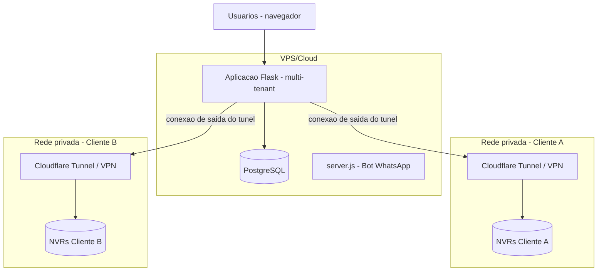

# Arquitetura de Deployment

## Estado atual (confirmado no código/comentários)

- Flask servido via Gunicorn (`app.py` docstring: `gunicorn "app:create_app()" -b 0.0.0.0:5000 -w 4`), aparentemente gerenciado via PM2.
- Processo Node.js separado (`server.js`) para o bot WhatsApp.
- `cloudflared.exe` presente no repositório — indica uso de Cloudflare Tunnel para acesso remoto, o que sugere que hoje a aplicação roda em uma máquina Windows (não um provedor cloud tradicional), possivelmente na própria rede da empresa/usina.
- PostgreSQL local (`localhost:5432`, conforme fallback em `config.py`).

## Problema central deste produto: NVRs atrás de rede privada

Diferente de um SaaS comum (onde tudo — aplicação e dados do cliente — pode viver na nuvem), aqui **os equipamentos físicos (NVRs/câmeras) estão na rede local de cada cliente**, geralmente sem IP público, atrás de firewall/NAT. Isso restringe as opções de deployment de forma real, não teórica.

## Alternativas

### A. Servidor único (tudo em uma máquina)
Aplicação + banco + bot WhatsApp na mesma máquina — é essencialmente o modelo atual.
- **Vantagem**: simples de operar, baixo custo, adequado a um único cliente/rede.
- **Desvantagem**: não escala para multi-tenant com clientes em redes diferentes — os NVRs de um segundo cliente, em outra rede privada, não seriam alcançáveis por essa única máquina, a menos que ela também tenha acesso de rede até lá (VPN por cliente).

### B. Docker Compose (containerização, ainda single-host)
Empacota aplicação, banco, bot em containers, orquestrados por `docker-compose` num único host.
- **Vantagem**: ambientes reproduzíveis (resolve, inclusive, o problema já identificado de dependência ausente em `requirements.txt` — um Dockerfile força a lista de dependências a ser explícita e testável); facilita replicar o setup em outra máquina/VPS.
- **Desvantagem**: sozinho, não resolve o problema de rede privada dos NVRs — é uma melhoria operacional, não uma solução de topologia.

### C. VPS/Cloud (aplicação central na nuvem)
Aplicação e banco hospedados em nuvem (ex.: uma VPS comum), acessível publicamente pelos usuários (operadores/gestores).
- **Vantagem**: acesso de qualquer lugar, sem depender de um túnel a partir da máquina do cliente; infraestrutura gerenciada, mais fácil de manter que uma máquina Windows local.
- **Desvantagem**: **não resolve sozinha** o problema de alcançar NVRs que estão atrás de firewall na rede do cliente — a nuvem não tem rota direta até um NVR sem IP público.

### D. Servidor local do cliente (on-premise)
Uma instância completa roda dentro da rede do próprio cliente.
- **Vantagem**: acesso direto aos NVRs, sem problema de rede.
- **Desvantagem**: é essencialmente o modelo A repetido por cliente — reintroduz o problema já descartado na análise de multi-tenancy (opção A: uma instalação por cliente), com todo o custo operacional de manter N instâncias.

### E. Híbrida: agente local + plataforma central
Uma aplicação central na nuvem (multi-tenant, dashboards, banco, IA se não depender de acesso direto ao NVR) + um **agente leve** instalado na rede de cada cliente, que só tem a função de falar com os NVRs locais e enviar/receber dados da plataforma central via conexão de saída (outbound), sem exigir porta aberta/IP público do lado do cliente.
- **Vantagem**: resolve o problema de rede privada de forma que escala para múltiplos clientes (cada cliente só instala um agente pequeno, não a aplicação inteira); a plataforma central pode ser genuinamente multi-tenant na nuvem.
- **Desvantagem**: mais complexo de construir do que os modelos anteriores — exige um protocolo de comunicação agente↔plataforma (ex.: conexão persistente ou polling do agente para a plataforma), e o agente precisa ser mantido/atualizado remotamente.

## Recomendação

**Fase 1-2 (MVP/primeiro cliente): C (VPS/Cloud) para a aplicação central, com Cloudflare Tunnel (já usado hoje) ou VPN ponto-a-ponto por cliente para alcançar os NVRs — um modelo de transição, não a arquitetura final.**

**Fase 4+ (Escala, múltiplos clientes reais): evoluir para E (agente local + plataforma central)** — é o único modelo que resolve estruturalmente "múltiplos clientes, cada um com NVRs em rede privada própria" sem reintroduzir uma instalação completa por cliente.

## Justificativa para este projeto

- O Cloudflare Tunnel já em uso hoje é, na prática, uma versão simples da ideia de "conexão de saída sem porta aberta" — não é descartado, é o embrião do modelo E. A evolução natural é generalizar essa ideia para múltiplos túneis/agentes (um por cliente), não trocar de abordagem.
- Construir o "agente" completo (opção E) antes de ter o primeiro cliente real seria engenharia especulativa — não sabemos ainda com certeza que topologia de rede os próximos clientes terão. Melhor validar com o modelo mais simples (C + túnel) primeiro.
- Docker Compose (opção B) vale a pena adotar cedo, independente da opção de topologia escolhida — resolve o problema real e já mapeado de "ambiente não reproduzível" (dependência ausente do `requirements.txt`), com custo baixo de adoção.

## Diagrama de deployment (estado-alvo intermediário, Fase 2-3)

