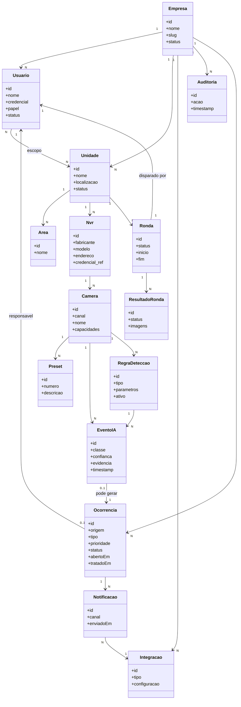

# Diagrama de Classes — Vigilante IA

## Três modelos diferentes, propositalmente distintos

É comum confundir estes três níveis — cada um responde uma pergunta diferente:

| Nível | Pergunta que responde | Onde vive |
|---|---|---|
| **Modelo de domínio** | Quais conceitos de negócio existem e como se relacionam? | `architecture/modelo-dominio.md` — conceitual, sem tipos de coluna, sem SQLAlchemy |
| **Modelo ORM** | Como o código Python representa essas entidades? | `models/*.py` — classes SQLAlchemy, com `db.Mapped`, relationships, métodos como `to_dict()` |
| **Modelo físico do banco** | Como as tabelas realmente existem no PostgreSQL? | `database/modelo-banco.md` + migrations Alembic — tipos de coluna reais, índices, constraints |

Os três **devem ser consistentes**, mas não são a mesma coisa. Um exemplo real do projeto atual que ilustra por que essa distinção importa: no domínio, "NVR" é um conceito único; no ORM/banco atual, existem **duas classes/tabelas** (`Nvr` e `NvrMonitorado`) para o mesmo conceito, porque nasceram em momentos diferentes do projeto para necessidades diferentes (ronda vs. conferência). Isso é uma decisão de implementação que diverge do domínio — não é "errado" por si só, mas é uma dívida a resolver conscientemente (ver `decisions/decisoes-pendentes.md`).

## Diagrama de classes conceitual (domínio-alvo, Mermaid)

## Explicação do diagrama

- **`Empresa` é a raiz de isolamento** — quase toda entidade chega até ela, direta ou indiretamente (via Unidade). Isso reflete a decisão de multi-tenancy discutida em `database/multi-tenancy.md`.
- **`Usuario` ←→ `Unidade` é N:N** (associação `escopo`) porque papéis como Supervisor/Operador podem estar restritos a algumas unidades, não à empresa inteira — Admin/Gestor, por convenção, têm acesso a todas as unidades da própria empresa sem precisar de linhas nessa associação (escopo implícito = empresa inteira).
- **`RegraDeteccao` é a peça que evita reescrever o motor de IA a cada novo tipo de detecção** — ela existe entre `Camera` e `EventoIA` propositalmente: o motor de ronda consulta "quais regras essa câmera tem" antes de decidir qual modelo rodar (detalhado em `architecture/ia.md`).
- **`EventoIA` "pode gerar" `Ocorrencia` (0..1)** — nem toda detecção vira ocorrência (ex.: confiança abaixo do threshold da regra); essa cardinalidade opcional é intencional.
- **`Ocorrencia` também pode nascer sem `EventoIA`** (ex.: falha de equipamento, ou registro manual de um operador) — por isso a seta é de `EventoIA` para `Ocorrencia`, não o inverso; `Ocorrencia` tem outras origens possíveis não desenhadas aqui para não poluir o diagrama (a lista completa de origens está em `architecture/modelo-dominio.md`).

## Onde este diagrama diverge do ORM atual

- Hoje não existe `Empresa`, `Papel` como entidade explícita, `Area`, `RegraDeteccao`, `Notificacao`, `Integracao`, `Auditoria` — todas marcadas como **criar** em `modelo-dominio.md`.
- Hoje `Nvr` e `NvrMonitorado` são duas classes ORM separadas representando o que este diagrama trata como uma única classe `Nvr` — a unificação é uma decisão a tomar (ver `decisions/decisoes-pendentes.md`), não uma correção automática.
- Hoje `Ocorrencia` não existe — é composta por `Alerta` + `MonitorEvent`.
