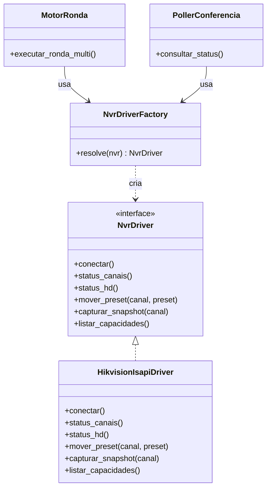

# Arquitetura de Equipamentos — Abstração de NVR/Câmera

## Estado atual (confirmado no código)

O protocolo ISAPI da Hikvision (autenticação HTTP Digest, endpoints específicos de PTZ/status/snapshot) está implementado diretamente em **três lugares diferentes**:

- `services/isapi_poller.py` — polling de disponibilidade.
- `core/ronda_multi_nvr.py` — movimentação PTZ e captura de snapshot durante ronda.
- `routes/conferencia_bp.py` — algumas chamadas diretas no contexto de cadastro/teste de conexão.

Não existe uma interface comum — cada arquivo monta `HTTPDigestAuth` e URLs ISAPI por conta própria. Isso significa que o sistema está **estruturalmente acoplado à Hikvision**: adicionar um segundo fabricante hoje exigiria duplicar lógica em três lugares, não estender um ponto único.

## Problema

Como permitir múltiplos fabricantes/protocolos sem reescrever o motor de ronda e o poller a cada novo fabricante suportado?

## Alternativas

### Integração direta (o que existe hoje)
Cada módulo fala diretamente com a API do fabricante.
- **Vantagem**: simples de implementar quando só existe um fabricante — é literalmente o que já está feito e funciona.
- **Desvantagem**: acoplamento estrutural; qualquer novo fabricante exige tocar em múltiplos arquivos, com risco de divergência de comportamento entre eles (exatamente o tipo de duplicação já identificada no projeto, ver plano de correção — dois `conferencia_loop.py` divergentes).

### Adapter Pattern
Uma interface comum (`NvrDriver`) com um método por operação (`mover_preset`, `capturar_snapshot`, `status_canais`); cada fabricante implementa essa interface.
- **Vantagem**: o resto do sistema (motor de ronda, poller) programa contra a interface, não contra a Hikvision; adicionar um fabricante = criar uma nova classe, sem tocar no motor.
- **Desvantagem**: exige que as operações sejam generalizáveis o suficiente entre fabricantes — protocolos muito diferentes podem forçar a interface a ficar genérica demais ou vazar detalhes específicos.

### Strategy Pattern
Similar ao Adapter, mas o foco é permitir trocar o **algoritmo/comportamento** em tempo de execução (ex.: "como mover PTZ" pode variar por modelo, mesmo dentro do mesmo fabricante).
- **Vantagem**: útil se, dentro da própria Hikvision, diferentes modelos de NVR exigirem lógicas ligeiramente diferentes (o que já é sugerido pelas notas do projeto, que mencionam mais de um modelo de NVR Hikvision).
- **Desvantagem**: adiciona uma camada de seleção de estratégia que só se justifica se essa variação realmente existir na prática.

### Factory
Um componente que, dado um NVR cadastrado (com seu `fabricante`), retorna a implementação de driver correta.
- **Vantagem**: centraliza a decisão de "qual driver usar" em um único lugar, evitando `if fabricante == "hikvision"` espalhado pelo código.
- **Desvantagem**: nenhuma real, é um complemento natural ao Adapter, não uma alternativa competindo com ele.

### ONVIF (protocolo padrão da indústria)
Em vez de drivers proprietários por fabricante, usar o protocolo ONVIF, suportado pela maioria dos fabricantes de CFTV profissional (incluindo Hikvision).
- **Vantagem**: um único driver ONVIF cobriria múltiplos fabricantes de uma vez, reduzindo o trabalho de suportar cada um individualmente.
- **Desvantagem**: ONVIF nem sempre expõe 100% das funcionalidades específicas de cada fabricante (o poller atual, por exemplo, consulta detalhes como saúde de HD e bitrate via ISAPI, que podem não ter equivalente ONVIF padronizado) — pode exigir um driver híbrido (ONVIF para o comum + extensão proprietária para o específico).

## Recomendação

**Adapter Pattern com Factory, mantendo apenas o driver Hikvision/ISAPI implementado agora — ONVIF como opção a avaliar quando o segundo fabricante for um requisito real, não antes.**

## Estrutura conceitual proposta

```
NvrDriver (interface)
 ├─ conectar()
 ├─ status_canais()
 ├─ status_hd()
 ├─ mover_preset(canal, preset)
 ├─ capturar_snapshot(canal)
 └─ listar_capacidades()

HikvisionIsapiDriver(NvrDriver)
 └─ implementação atual migrada de services/isapi_poller.py + trechos de core/ronda_multi_nvr.py

NvrDriverFactory
 └─ resolve(nvr) -> instância do driver, baseado em nvr.fabricante

Camera.capacidades (jsonb, ver database/modelo-banco.md)
 └─ { "ptz": bool, "presets": bool, "captura": bool, "stream": bool, "deteccao_local": bool }
```

**Diagrama:**



## O que implementar agora vs. deixar para o futuro

**Agora (Fase 1)**: extrair a interface `NvrDriver` e migrar o código ISAPI já existente para uma única implementação `HikvisionIsapiDriver` — **sem alterar a lógica interna**, só mudando "onde ela mora". Isso já resolve a duplicação entre os três arquivos atuais e prepara o terreno, mesmo com um único fabricante suportado.

**Futuro (Fase 5, quando houver demanda real de um segundo fabricante)**: implementar o segundo driver (proprietário ou ONVIF, dependendo do fabricante concreto que aparecer) e validar que o motor de ronda/poller realmente não precisaram ser tocados — esse é o teste real de que a abstração funcionou.

**Não fazer agora**: implementar ONVIF "por precaução" sem um fabricante concreto pedindo — seria abstração especulativa, indo contra o princípio de arquitetura pragmática que você definiu.
