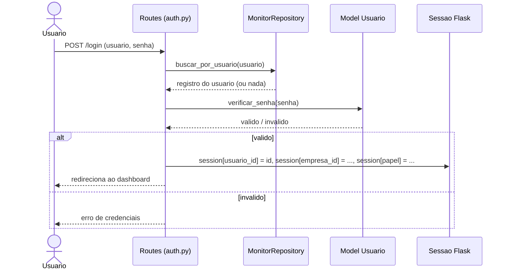
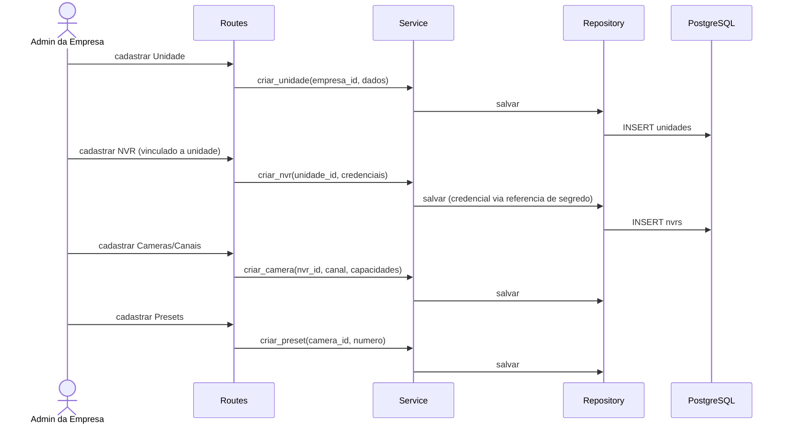
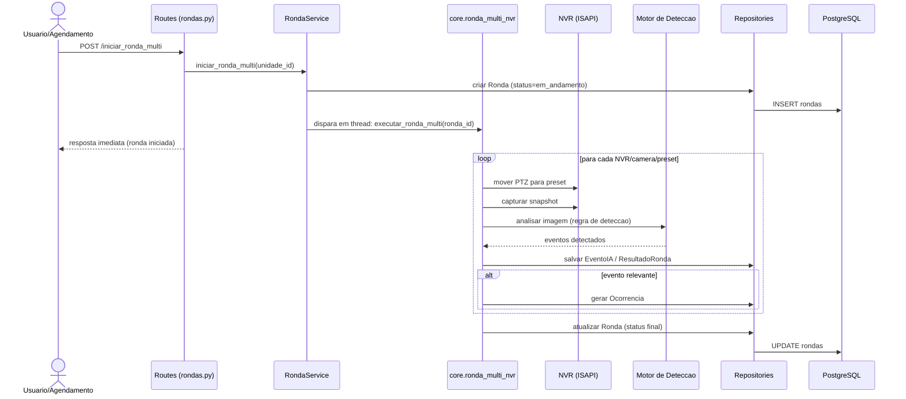
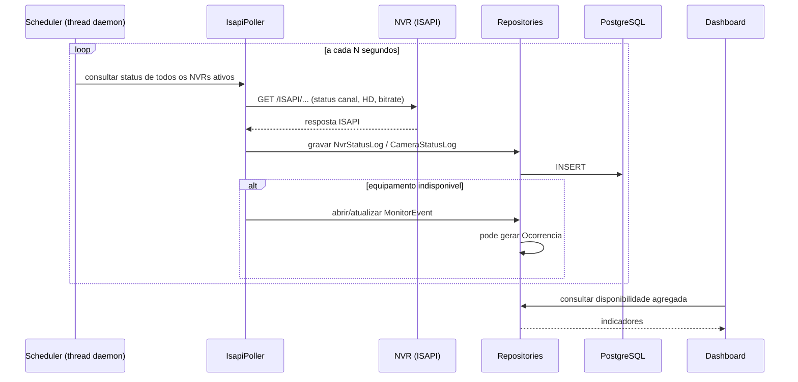
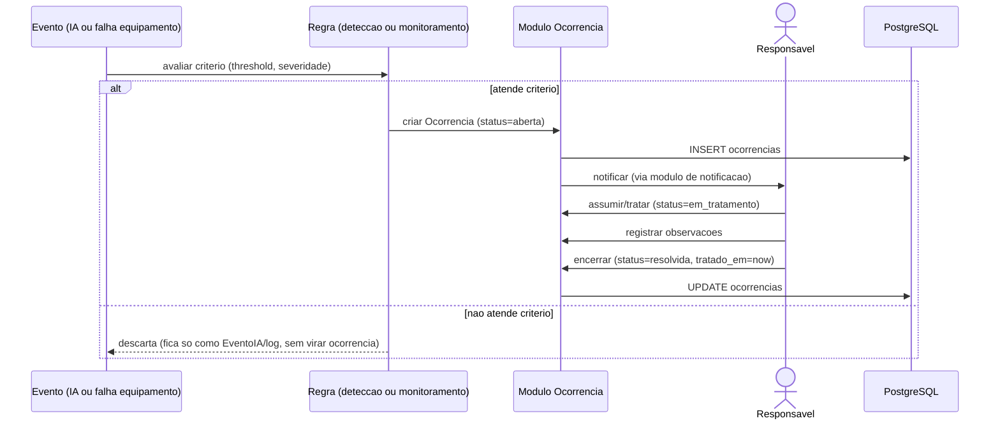
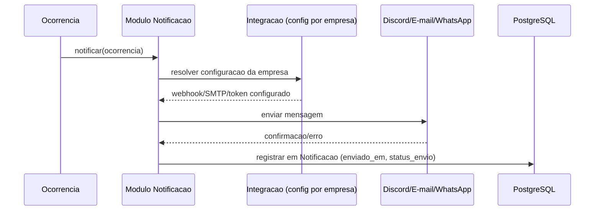

# Fluxos Principais — Diagramas de Sequência

## Fluxo 1 — Login

**Estado atual vs. alvo**: hoje `session` só carrega `monitor_id` (`routes/auth.py`, `core/auth.py`). O alvo acrescenta `empresa_id` e `papel`, sem trocar o mecanismo de sessão em si.

## Fluxo 2 — Cadastro de equipamento

**Estado atual**: já existe fluxo equivalente para NVR/preset (`routes/nvr.py`, `routes/conferencia_bp.py`), mas sem a etapa de Unidade nem vínculo com empresa.

## Fluxo 3 — Execução de ronda

**Estado atual**: o disparo hoje usa `subprocess.Popen` apontando para um caminho de script inexistente (bug confirmado, ver plano de correção) — o diagrama já reflete a correção recomendada (chamada direta em thread a `executar_ronda_multi`), não o comportamento quebrado atual.

## Fluxo 4 — Conferência de câmera

**Estado atual**: já funciona essencialmente assim (`services/conferencia_loop.py`, `services/isapi_poller.py`), com a ressalva já mapeada da duplicidade com `conferencia_loop.py` na raiz do projeto (ver plano de correção).

## Fluxo 5 — Ocorrência

**Estado atual**: fragmentado — hoje um `Alerta` (de IA) não passa por esse ciclo de tratativa formal; um `MonitorEvent` (de equipamento) tem abertura/fechamento automático, mas não tratativa humana estruturada. Este fluxo representa o estado-alvo pós-unificação.

## Fluxo 6 — Notificação

**Estado atual**: hoje o envio existe (`discord_notification_service.py`, `email_service.py`) mas resolve a configuração de forma global (`app.config`), não por empresa, e não fica registro consultável do que foi enviado — ambos os pontos fazem parte da evolução descrita aqui.
