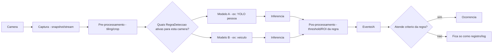

# Arquitetura de IA / Computer Vision

## Pipeline conceitual

```
Câmera → Captura (snapshot) → Pré-processamento (tiling 3x3) → Modelo (YOLOv8) →
Inferência → Pós-processamento (threshold, filtro por ROI) → EventoIA →
Regra de Detecção → Ocorrência (se aplicável)
```

## Estado atual — onde existe acoplamento (confirmado no código)

`core/ronda_multi_nvr.py` implementa esse pipeline inteiro **hardcoded para um único caso**: "rodar YOLOv8 buscando a classe pessoa, com tiling 3×3, confiança 0.30, imgsz 960". Não existe separação entre:
- **o que capturar** (câmera/preset — isso já é parametrizado, via `NvrPreset`);
- **qual modelo rodar** (hoje fixo: YOLOv8 pessoa);
- **quais parâmetros usar** (hoje fixos no código: threshold, tiling);
- **o que fazer com o resultado** (hoje fixo: sempre vira `Alerta` se detectar pessoa).

Ou seja, o acoplamento está entre "orquestração da ronda" (mover câmera, tirar foto) e "decisão de IA" (qual modelo, qual critério) — as duas coisas estão na mesma função, sem fronteira.

## Problema

Como permitir novos tipos de detecção (veículo, invasão de área, permanência, aglomeração, objeto abandonado) sem reescrever `core/ronda_multi_nvr.py` a cada novo tipo?

## Arquitetura proposta

Introduzir a **Regra de Detecção** como a peça que desacopla "orquestração" de "decisão de IA" (já detalhada em `architecture/modelo-dominio.md` e `database/modelo-banco.md`):



**Mudança de responsabilidade do motor de ronda**: hoje ele *executa* uma detecção fixa; no modelo-alvo, ele *orquestra* — pergunta "quais regras essa câmera tem?", chama o(s) modelo(s) indicado(s) por cada regra, e delega a decisão de "isso vira ocorrência?" para a regra, não para código fixo dentro do motor.

## O que isso evita, concretamente

Adicionar detecção de veículo, no modelo atual, exigiria editar `core/ronda_multi_nvr.py` (que já tem ~880 linhas, conforme a leitura do arquivo) para incluir um novo `if`/branch de modelo. No modelo proposto, exigiria: (1) cadastrar um `ModeloDeteccao` novo, (2) cadastrar `RegraDeteccao` associando esse modelo às câmeras relevantes — **sem tocar no motor**.

## O que não muda (e não deveria mudar)

- A parte de **captura/orquestração de câmera** (mover PTZ, tirar snapshot, tiling de imagem grande) é infraestrutura de visão computacional que já funciona bem e é reaproveitável por qualquer modelo futuro — não é específica de "detectar pessoa", é específica de "como lidar com pessoas pequenas e distantes no frame", que é um problema válido para outros tipos de detecção também.
- O uso de YOLOv8 em si (ver `architecture/stack.md` para a avaliação da tecnologia) não muda — a mudança é arquitetural (como o modelo é escolhido e configurado), não de qual biblioteca de IA usar.

## O que fazer agora vs. depois

**Agora (Fase 1, abertura estrutural)**: criar as tabelas `regras_deteccao`/`eventos_ia` (já especificadas em `database/modelo-banco.md`) e refatorar `core/ronda_multi_nvr.py` para consultar regras em vez de ter a detecção de pessoa hardcoded — **mantendo o comportamento atual idêntico** (a única regra cadastrada, inicialmente, é "detectar pessoa", reproduzindo exatamente o que já existe hoje).

**Depois (Fase 5)**: adicionar o segundo tipo de detecção real, validando que isso realmente não exige tocar no motor — esse é o teste de que a arquitetura cumpriu o objetivo, assim como no caso dos drivers de equipamento.

**Não fazer agora**: treinar/integrar modelos para os 8 tipos de detecção citados na visão de produto. Isso é trabalho de ciência de dados/CV real (coleta de dado, treino, validação), não é uma tarefa de arquitetura de software — deve ser tratado como iniciativa própria quando houver demanda de cliente concreta para um tipo específico.
