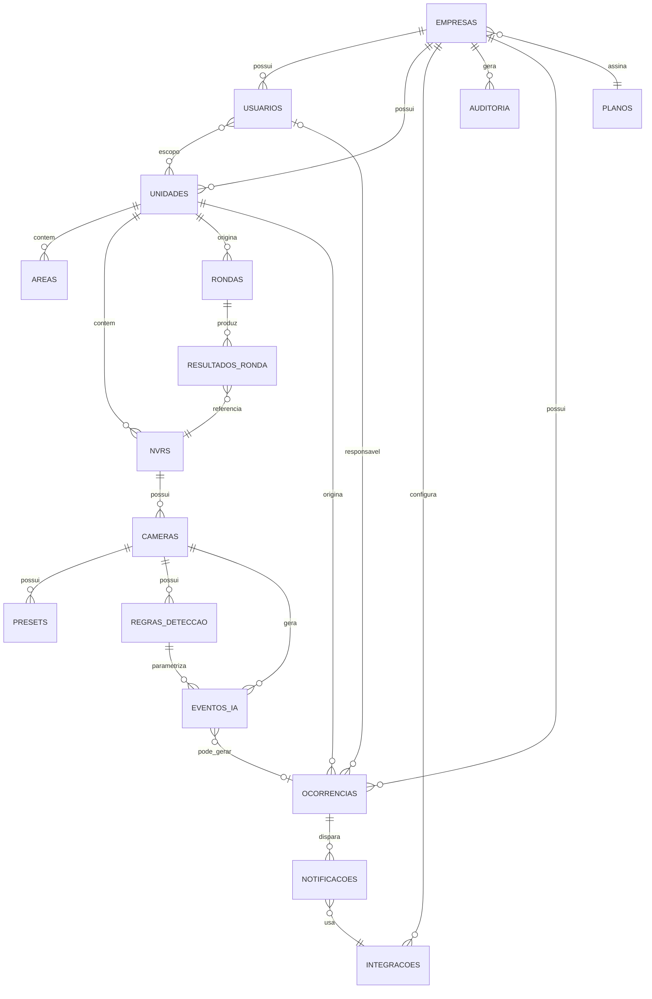

# Modelo Lógico do Banco de Dados — PostgreSQL

Este documento traduz o modelo de domínio (`architecture/modelo-dominio.md`) em tabelas. **Ainda não é SQL** — é a especificação lógica (nomes, tipos, chaves, índices) que viraria uma migration Alembic quando chegar a hora de implementar.

## Tabelas propostas

### `empresas`
| Coluna | Tipo | Regras |
|---|---|---|
| id | serial/uuid | PK |
| nome | varchar(200) | NOT NULL |
| slug | varchar(80) | UNIQUE, NOT NULL — usado em URLs/identificação amigável |
| status | varchar(20) | NOT NULL, CHECK IN ('ativa','suspensa') |
| criado_em | timestamp | NOT NULL, default now() |

### `usuarios`
| Coluna | Tipo | Regras |
|---|---|---|
| id | serial | PK |
| empresa_id | integer | FK → empresas.id, **nullable apenas para Super Admin** |
| nome | varchar(150) | NOT NULL |
| usuario_login | varchar(80) | UNIQUE **por empresa** (não globalmente — dois clientes podem ter usuário "admin" cada um) |
| senha_hash | varchar(255) | NOT NULL |
| papel | varchar(20) | NOT NULL, CHECK IN ('super_admin','admin_empresa','gestor','supervisor','operador','visualizador') |
| status | varchar(20) | NOT NULL, default 'ativo' |
| criado_em | timestamp | NOT NULL |

**Índice**: `(empresa_id, usuario_login)` UNIQUE composto — resolve a unicidade "por empresa", não global.
**Origem**: evolução de `models/monitor.py:Monitor`, que hoje tem `usuario` único globalmente — a mudança de unicidade (global → por empresa) é uma decisão que precisa de migração de dado cuidadosa.

### `usuario_unidade` (associativa N:N)
| Coluna | Tipo | Regras |
|---|---|---|
| usuario_id | integer | FK → usuarios.id |
| unidade_id | integer | FK → unidades.id |

PK composta `(usuario_id, unidade_id)`. Só populada para papéis de escopo restrito (Supervisor/Operador); ausência de linhas = sem restrição adicional (para Admin/Gestor, cujo escopo é a empresa inteira).

### `unidades`
| Coluna | Tipo | Regras |
|---|---|---|
| id | serial | PK |
| empresa_id | integer | FK → empresas.id, NOT NULL |
| nome | varchar(150) | NOT NULL |
| localizacao | varchar(250) | nullable |
| status | varchar(20) | NOT NULL, default 'ativa' |

**Índice**: `empresa_id` (toda listagem de unidades é filtrada por empresa).
**Origem**: substitui o campo texto `site` de `models/nvr.py`/`models/nvr_monitorado.py`.

### `areas` (opcional, Could Have)
| Coluna | Tipo | Regras |
|---|---|---|
| id | serial | PK |
| unidade_id | integer | FK → unidades.id, NOT NULL |
| nome | varchar(100) | NOT NULL |

### `nvrs`

Representa o **grupo/site organizacional** de câmeras (ex.: `NVR-GD_GETULINA-SP`) — na maioria dos casos é também um dispositivo físico real que a plataforma consulta via ISAPI, mas pode existir como agrupador puramente organizacional quando todas as câmeras dele são avulsas (ver nota de nullability abaixo).

| Coluna | Tipo | Regras |
|---|---|---|
| id | serial | PK |
| unidade_id | integer | FK → unidades.id, NOT NULL (empresa_id fica implícito via unidade — **não duplicar**, ver nota abaixo) |
| nome | varchar(150) | NOT NULL — ex. "NVR-GD_GETULINA-SP", o identificador do grupo/site |
| fabricante | varchar(50) | NOT NULL, default 'hikvision' |
| modelo | varchar(80) | nullable |
| endereco_ip | varchar(50) | **nullable** — só preenchido quando o NVR é, ele mesmo, um dispositivo físico consultável (a maioria dos casos); fica nulo quando o registro existe só como agrupador de câmeras avulsas |
| porta | integer | default 80, nullable |
| usuario_acesso | varchar(80) | nullable (mesma regra do `endereco_ip`) |
| credencial_ref | varchar(255) | nullable — referência ao segredo (não a senha em si; ver `security/seguranca.md`) |
| status | varchar(20) | default 'ativo' |

**Índice**: `unidade_id`; `endereco_ip` (usado em consultas de diagnóstico, quando preenchido).
**Origem**: unifica `models/nvr.py:Nvr` e `models/nvr_monitorado.py:NvrMonitorado` — **decisão pendente de aprovação**, ver `decisions/decisoes-pendentes.md`. Como o banco está sendo reconstruído do zero (dados anteriores perdidos), essa unificação deixa de ter risco de migração de dado em produção — só precisa ser confirmada como o modelo definitivo antes da primeira migration real.

### `cameras`

Toda câmera pertence a um `nvr_id` (o grupo/site), mas a forma de **conectar** com ela varia conforme `modo_conexao`: via canal de um NVR físico, ou via IP próprio da câmera (dome/fixa endereçável diretamente) — refletindo a prática real observada (ex.: um NVR com 11 canais mistos entre bullet/dome/PTZ).

| Coluna | Tipo | Regras |
|---|---|---|
| id | serial | PK |
| nvr_id | integer | FK → nvrs.id, NOT NULL — grupo/site ao qual a câmera pertence, sempre obrigatório |
| modo_conexao | varchar(20) | NOT NULL, CHECK IN ('via_nvr', 'ip_direto') |
| canal | integer | nullable — obrigatório em regra (ver CHECK) quando `modo_conexao='via_nvr'` |
| endereco_ip | varchar(50) | nullable — obrigatório em regra quando `modo_conexao='ip_direto'` |
| porta | integer | nullable — usado só em `modo_conexao='ip_direto'` |
| usuario_acesso | varchar(80) | nullable — credencial própria da câmera, usado só em `modo_conexao='ip_direto'` |
| credencial_ref | varchar(255) | nullable — idem, referência ao segredo |
| tipo | varchar(20) | NOT NULL, CHECK IN ('bullet','dome','dome_interna','ptz','generica') |
| nome | varchar(100) | nullable — ex. "GTL2 - BULLET PORTAO", "GTL2 - DOME INTERNA 1" |
| capacidades | jsonb | NOT NULL, default '{}' — ex.: `{"ptz": true, "presets": true, "captura": true}`, sugerido a partir de `tipo` no cadastro e editável depois |

**CHECK adicional**: `(modo_conexao = 'via_nvr' AND canal IS NOT NULL) OR (modo_conexao = 'ip_direto' AND endereco_ip IS NOT NULL)` — garante que toda câmera tenha uma forma real de ser alcançada, qualquer que seja o modo.
**Índice**: `(nvr_id, canal)` UNIQUE composto parcial (só aplicável quando `modo_conexao='via_nvr'`) — um canal não se repete no mesmo NVR físico; `(nvr_id, endereco_ip)` para o caso `ip_direto`.
**Por que jsonb para capacidades**: capacidades variam por fabricante/modelo e crescem ao longo do tempo (Fase 5 adiciona fabricantes com capacidades diferentes) — uma coluna booleana fixa por capacidade exigiria migration a cada nova capacidade; jsonb evita isso sem perder a possibilidade de indexar (`GIN index` em `capacidades`, se necessário no futuro).
**Fluxo de cadastro "subir o NVR"**: ao cadastrar um `nvr` com `endereco_ip`/credencial preenchidos, o sistema consulta ISAPI (`status_canais()`, já existente em `services/isapi_poller.py`) e cria automaticamente um registro de `Camera` por canal encontrado, com `modo_conexao='via_nvr'`, sugerindo `nome`/`tipo` a partir do que o equipamento retornar — o operador edita depois, não recadastra do zero.
**Fluxo de cadastro "câmera por câmera"**: o operador escolhe (ou cria) primeiro o `nvr` (grupo/site), depois cadastra a câmera com `modo_conexao='ip_direto'` e seu próprio IP/credencial — nunca existe câmera sem `nvr_id`.
**Driver de equipamento**: o `HikvisionIsapiDriver` (`architecture/equipamentos.md`) atende os dois modos sem precisar de uma segunda implementação — a diferença é só de onde ele lê o endereço de conexão (do NVR pai, ou da própria câmera).

### `presets`
| Coluna | Tipo | Regras |
|---|---|---|
| id | serial | PK |
| camera_id | integer | FK → cameras.id, NOT NULL |
| numero | integer | NOT NULL |
| descricao | varchar(150) | nullable |

**Índice**: `(camera_id, numero)` UNIQUE composto.
**Origem**: `models/nvr.py:NvrPreset` — mantém-se essencialmente igual, só ganha FK correta para `cameras` em vez do vínculo atual por string de negócio (`nvr_id` textual, hoje).

### `rondas`
| Coluna | Tipo | Regras |
|---|---|---|
| id | serial | PK |
| unidade_id | integer | FK → unidades.id, NOT NULL |
| usuario_id | integer | FK → usuarios.id — quem disparou (nullable se agendada) |
| status | varchar(20) | NOT NULL, CHECK IN ('em_andamento','finalizada','com_alertas','erro') |
| iniciado_em | timestamp | NOT NULL |
| finalizado_em | timestamp | nullable |

**Índice**: `(unidade_id, iniciado_em desc)` — consulta mais comum é "últimas rondas de uma unidade".
**Origem**: `models/ronda.py:Ronda`, ganha `unidade_id` no lugar da referência atual solta a NVRs.

### `resultados_ronda`
| Coluna | Tipo | Regras |
|---|---|---|
| id | serial | PK |
| ronda_id | integer | FK → rondas.id, NOT NULL |
| nvr_id | integer | FK → nvrs.id, NOT NULL |
| status | varchar(20) | NOT NULL |
| imagens_ref | jsonb | nullable — caminhos/referências de evidência |

**Origem**: `models/ronda.py:RondaNvr`.

### `regras_deteccao`
| Coluna | Tipo | Regras |
|---|---|---|
| id | serial | PK |
| camera_id | integer | FK → cameras.id, NOT NULL |
| tipo | varchar(40) | NOT NULL, ex. 'pessoa','veiculo','invasao_area' |
| parametros | jsonb | NOT NULL, default '{}' |
| ativo | boolean | NOT NULL, default true |

**Índice**: `(camera_id, tipo)`.

### `eventos_ia`
| Coluna | Tipo | Regras |
|---|---|---|
| id | serial | PK |
| camera_id | integer | FK → cameras.id, NOT NULL |
| regra_id | integer | FK → regras_deteccao.id, nullable |
| classe | varchar(40) | NOT NULL |
| confianca | numeric(5,4) | NOT NULL |
| evidencia_ref | varchar(255) | nullable |
| ocorrencia_id | integer | FK → ocorrencias.id, nullable |
| timestamp | timestamp | NOT NULL |

**Índice**: `(camera_id, timestamp desc)` — série temporal por câmera.
**Origem**: parte de `models/alerta.py:Alerta`, separando "detecção bruta" de "ocorrência a tratar".
**Risco de crescimento**: tabela de série temporal, cresce com cada detecção — mesma preocupação de `nvr_status_log`/`camera_status_log` hoje (ver `security/seguranca.md`/roadmap — retenção é decisão de Fase 4, informada por volume real).

### `ocorrencias`
| Coluna | Tipo | Regras |
|---|---|---|
| id | serial | PK |
| empresa_id | integer | FK → empresas.id, NOT NULL (duplicada aqui deliberadamente — ver nota abaixo) |
| unidade_id | integer | FK → unidades.id, NOT NULL |
| origem | varchar(20) | NOT NULL, CHECK IN ('deteccao_ia','falha_equipamento','manual','mensagem_externa') |
| tipo | varchar(40) | nullable |
| prioridade | varchar(10) | default 'media' |
| status | varchar(20) | NOT NULL, default 'aberta' |
| responsavel_id | integer | FK → usuarios.id, nullable |
| aberto_em | timestamp | NOT NULL |
| tratado_em | timestamp | nullable |

**Índice**: `(empresa_id, status)` (dashboards filtram por empresa+status ativamente); `(unidade_id, aberto_em desc)`.
**Por que `empresa_id` duplicado aqui, e não só via `unidade_id`**: é uma exceção deliberada à regra geral "não duplicar dado" — ocorrências são a tabela mais consultada por filtros de dashboard/RLS, e ter `empresa_id` direto evita um JOIN obrigatório em toda política de Row-Level Security. Vale reavaliar caso a caso; para as demais tabelas, `empresa_id` fica implícito via `unidade_id`, sem duplicar.
**Origem**: unifica `models/alerta.py:Alerta` + `models/monitoring.py:MonitorEvent`.

### `notificacoes`
| Coluna | Tipo | Regras |
|---|---|---|
| id | serial | PK |
| ocorrencia_id | integer | FK → ocorrencias.id, NOT NULL |
| integracao_id | integer | FK → integracoes.id, NOT NULL |
| enviado_em | timestamp | NOT NULL |
| status_envio | varchar(20) | NOT NULL |

### `integracoes`
| Coluna | Tipo | Regras |
|---|---|---|
| id | serial | PK |
| empresa_id | integer | FK → empresas.id, NOT NULL |
| tipo | varchar(20) | NOT NULL, CHECK IN ('discord','email','whatsapp') |
| configuracao | jsonb | NOT NULL |
| ativo | boolean | default true |

**Índice**: `(empresa_id, tipo)` UNIQUE — uma empresa tem no máximo uma configuração ativa por tipo (decisão simplificadora do MVP).

### `auditoria`
| Coluna | Tipo | Regras |
|---|---|---|
| id | bigserial | PK |
| empresa_id | integer | FK → empresas.id, NOT NULL |
| usuario_id | integer | FK → usuarios.id, nullable (ação do sistema) |
| acao | varchar(60) | NOT NULL |
| entidade | varchar(60) | NOT NULL |
| entidade_id | integer | nullable |
| detalhes | jsonb | nullable |
| timestamp | timestamp | NOT NULL, default now() |

**Índice**: `(empresa_id, timestamp desc)`.
**Risco de crescimento**: cresce continuamente, sem expurgo definido — decisão adiada deliberadamente (RNF08/roadmap Fase 4), mas deve nascer com índice correto desde já.

### `planos`
| Coluna | Tipo | Regras |
|---|---|---|
| id | serial | PK |
| nome | varchar(60) | NOT NULL |
| limites | jsonb | NOT NULL — ex.: `{"max_cameras": 50, "max_unidades": 5}` |
| features | jsonb | NOT NULL — ex.: `{"whatsapp": true, "ia_veiculo": false}` |

`empresas.plano_id` referencia esta tabela.

## Diagrama ER (Mermaid)

## Decisões de cardinalidade explicadas

- **`empresas` 1:N `usuarios`**: cada usuário pertence a no máximo uma empresa — decisão consciente de simplicidade (um consultor que atende duas empresas clientes precisaria de dois logins). Alternativa (N:N usuário-empresa) foi descartada por adicionar complexidade que nenhum requisito atual pede.
- **`usuarios` N:N `unidades`**: já justificado no diagrama de classes — só para papéis de escopo restrito.
- **`nvrs` 1:N `cameras` 1:N `presets`**: reflete a hierarquia física real do equipamento (um NVR tem vários canais/câmeras, cada câmera PTZ tem vários presets).
- **`eventos_ia` N:1 opcional `ocorrencias`**: nem toda detecção vira ocorrência — por isso FK nullable, não obrigatória.

## Onde colocar a FK — regra geral usada

FK sempre no lado "N" da relação 1:N, apontando para o lado "1" — sem exceções neste modelo. A única duplicação deliberada de chave (`empresa_id` em `ocorrencias`, além de via `unidade_id`) está justificada acima e não deve ser tomada como padrão para outras tabelas.

## Campos que devem ter índice (resumo)

Toda FK usada em filtro de listagem (`empresa_id`, `unidade_id`, `camera_id`, `nvr_id`) — e toda combinação `(tenant_ou_pai, timestamp)` nas tabelas de série temporal (`eventos_ia`, `auditoria`, e as já existentes `nvr_status_log`/`camera_status_log`), porque o padrão de consulta dominante nesse tipo de tabela é "últimos N registros de X".

## Onde existe risco de crescimento descontrolado

`eventos_ia`, `auditoria`, e as tabelas já existentes `nvr_status_log`/`camera_status_log` — todas são séries temporais sem expurgo definido neste modelo. Isso é proposital (decisão de retenção adiada para quando houver volume real — ver `decisions/roadmap-engenharia.md`, Fase 4), mas registrado aqui para não ser esquecido.
